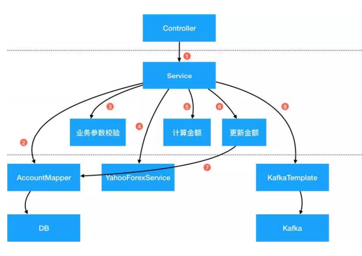
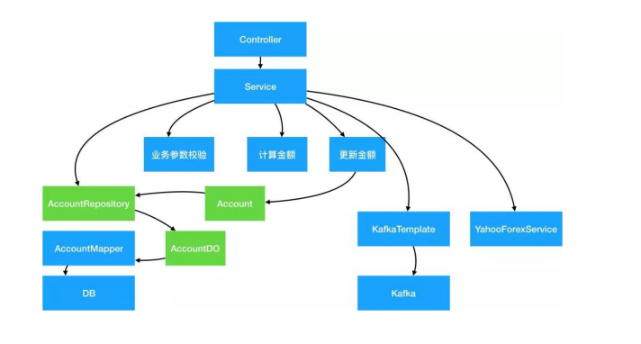
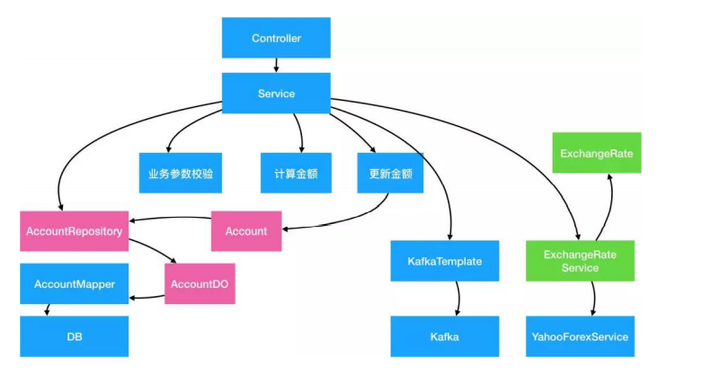
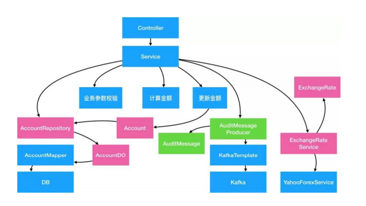
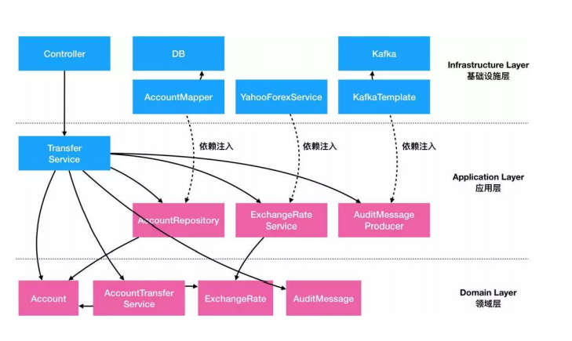
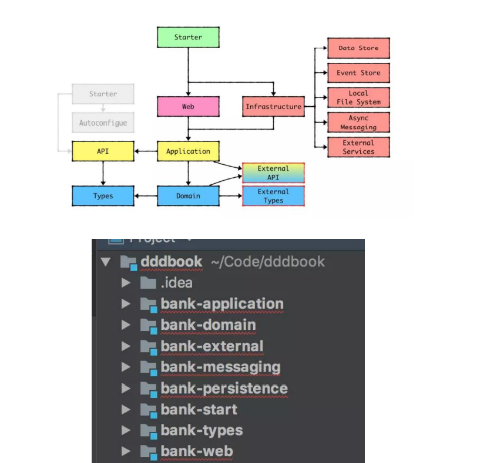

# 第一讲 Domain Primitive

## 1、将隐形的概念显性化
  我们发现把 PhoneNumber 显性化之后，其实是生成了一个 Type（数据类
型）和一个 Class（类）：
-  Type 指我们在今后的代码里可以通过 PhoneNumber 去显性的标识电话号这个概念。
- Class 指我们可以把所有跟电话号相关的逻辑完整的收集到一个文件里。

## 接口的清晰度

重构后的方法签名变成了很清晰的：
```java
public User register(Name, PhoneNumber, Address)
```
而之前容易出现的 bug，如果按照现在的写法
```java
service.register(new Name("殷浩"), new Address("浙江省杭州市余杭区文三西路 969 号"), new Phone
Number("0571-12345678"));
```
让接口 API 变得很干净，易拓展。

## 数据验证和错误处理
```java
public User register(
@NotNull Name name, @NotNull PhoneNumber phone, @NotNull Address address
) // no throws
```
如前文代码展示的，重构后的方法里，完全没有了任何数据验证的逻辑，也不会抛
ValidationException 。原因是因为 DP 的特性，只要是能够带到入参里的一定是正确的或
null（Bean Validation 或 lombok 的注解能解决 null 的问题）。所以我们把数据验证的
工作量前置到了调用方，而调用方本来就是应该提供合法数据的，所以更加合适。
再展开来看，使用 DP 的另一个好处就是代码遵循了 DRY 原则和单一性原则，如果未来需
要修改 PhoneNumber 的校验逻辑，只需要在一个文件里修改即可，所有使用到了
PhoneNumber 的地方都会生效。

## 业务代码的清晰度
```java
SalesRep rep = salesRepRepo.findRep(phone.getAreaCode());
User user = xxx;
return userRepo.save(user);
```
除了在业务方法里不需要校验数据之外，原来的一段胶水代码 findAreaCode 被改为了
PhoneNumber 类的一个计算属性 getAreaCode ，让代码清晰度大大提升。而且胶水代码
通常都不可复用，但是使用了 DP 后，变成了可复用、可测试的代码。我们能看到，在刨
除了数据验证代码、胶水代码之后，剩下的都是核心业务逻辑。（ Entity 相关的重构在后
面文章会谈到，这次先忽略）
## 2、将隐形的上下文显性化
```java
public void pay(BigDecimal money, Long recipientId) {
BankService.transfer(money, "CNY", recipientId);
}
```
```java
@Value
public class Money {
private BigDecimal amount;
private Currency currency;
public Money(BigDecimal amount, Currency currency) {
this.amount = amount;
this.currency = currency;
}
}

public void pay(Money money, Long recipientId) {
BankService.transfer(money, recipientId);
}
```
## 3、封装多对象行为
在这个 case 里，可以将转换汇率的功能，封装到一个叫做 ExchangeRate 的 DP 里：
```java
@Value
public class ExchangeRate {
private BigDecimal rate;
private Currency from;
private Currency to;
public ExchangeRate(BigDecimal rate, Currency from, Currency to) {
this.rate = rate;
this.from = from;
this.to = to;
}
public Money exchange(Money fromMoney) {
notNull(fromMoney);
isTrue(this.from.equals(fromMoney.getCurrency()));
BigDecimal targetAmount = fromMoney.getAmount().multiply(rate);
return new Money(targetAmount, to);
}
}

public void pay(Money money, Currency targetCurrency, Long recipientId) {
ExchangeRate rate = ExchangeService.getRate(money.getCurrency(), targetCurrency);
Money targetMoney = rate.exchange(money);
BankService.transfer(targetMoney, recipientId);
}
```
## Domain Primitive 的定义

让我们重新来定义一下 Domain Primitive ：Domain Primitive 是一个在特定领域里，拥
有精准定义的、可自我验证的、拥有行为的 Value Object 。
- DP 是一个传统意义上的 Value Object，拥有 Immutable 的特性
- DP 是一个完整的概念整体，拥有精准定义
- DP 使用业务域中的原生语言
- DP 可以是业务域的最小组成部分、也可以构建复杂组合
  
**使用 Domain Primitive 的三原则**
- 让隐性的概念显性化
- 让隐性的上下文显性化
- 封装多对象行为

## 什么情况下应该用 Domain Primitive

常见的 DP 的使用场景包括：
- 有格式限制的 String：比如 Name，PhoneNumber，OrderNumber，ZipCode，
Address 等。
- 有限制的 Integer：比如 OrderId（>0），Percentage（0-100%），Quantity（>=0）
等。
- 可枚举的 int ：比如 Status（一般不用 Enum 因为反序列化问题）。
358 < 第一部分 淘系年度精选技术栈内容 / 后端篇
- Double 或 BigDecimal：一般用到的 Double 或 BigDecimal 都是有业务含义的，比如 T
emperature、Money、Amount、ExchangeRate、Rating 等。
- 复杂的数据结构：比如 Map<String, List<Integer>> 等，尽量能把 Map 的所有操作
包装掉，仅暴露必要行为。

## 老应用重构的流程

### 第一步 - 创建 Domain Primitive，收集所有 DP 行为

在前文中，我们发现取电话号的区号这是一个可以独立出来的、可以放入 PhoneNumber
这个 Class 的逻辑。类似的，在真实的项目中，以前散落在各个服务或工具类里面的代码，
可以都抽出来放在 DP 里，成为 DP 自己的行为或属性。这里面的原则是：所有抽离出来
的方法要做到无状态，比如原来是 static 的方法。如果原来的方法有状态变更，需要将改
变状态的部分和不改状态的部分分离，然后将无状态的部分融入 DP 。因为 DP 本身不能
带状态，所以一切需要改变状态的代码都不属于 DP 的范畴。

### 第二步 - 替换数据校验和无状态逻辑

为了保障现有方法的兼容性，在第二步不会去修改接口的签名，而是通过代码替换原有的校
验逻辑和根 DP 相关的业务逻辑。

### 第三步 - 创建新接口

创建新接口，将 DP 的代码提升到接口参数层：

# 第二讲 应用架构

- 独立于框架：架构不应该依赖某个外部的库或框架，不应该被框架的结构所束缚。
- 独立于 UI：前台展示的样式可能会随时发生变化（今天可能是网页、明天可能变成
console、后天是独立 app），但是底层架构不应该随之而变化。
- 独立于底层数据源：无论今天你用 MySQL、Oracle 还是 MongoDB、CouchDB，甚至
使用文件系统，软件架构不应该因为不同的底层数据储存方式而产生巨大改变。
- 独立于外部依赖：无论外部依赖如何变更、升级，业务的核心逻辑不应该随之而大幅变
化。
- 可测试：无论外部依赖了什么数据库、硬件、UI 或者服务，业务的逻辑应该都能够快
速被验证正确性。

## 很常见的代码样式
被叫做 Transaction Script（事务脚本）。虽然这种类似于脚本的写法在功能上没有什么问
题，但是长久来看，他有以下几个很大的问题：可维护性差、可扩展性差、可测试性差。

## 问题 1-可维护性能差

一个应用最大的成本一般都不是来自于开发阶段，而是应用整个生命周期的总维护成本，所
以代码的可维护性代表了最终成本。
可维护性 = 当依赖变化时，有多少代码需要随之改变
参考以上的案例代码，事务脚本类的代码很难维护因为以下几点：
- 数据结构的不稳定性：AccountDO 类是一个纯数据结构，映射了数据库中的一个表。
这里的问题是数据库的表结构和设计是应用的外部依赖，长远来看都有可能会改变，比
如数据库要做 Sharding，或者换一个表设计，或者改变字段名。
- 依赖库的升级：AccountMapper 依赖 MyBatis 的实现，如果 MyBatis 未来升级版本，
可能会造成用法的不同（可以参考 iBatis 升级到基于注解的 MyBatis 的迁移成本）。同
样的，如果未来换一个 ORM 体系，迁移成本也是巨大的。
淘系技术 2020 技术年货 > 365 - 第三方服务依赖的不确定性：第三方服务，比如 Yahoo 的汇率服务未来很有可能会有
变化：轻则 API 签名变化，重则服务不可用需要寻找其他可替代的服务。在这些情况下
改造和迁移成本都是巨大的。同时，外部依赖的兜底、限流、熔断等方案都需要随之改
变。
- 第三方服务 API 的接口变化：YahooForexService.getExchangeRate 返回的结果是小数
点还是百分比？入参是（source, target）还是（target, source）？谁能保证未来接口
不会改变？如果改变了，核心的金额计算逻辑必须跟着改，否则会造成资损。
- 中间件更换：今天我们用 Kafka 发消息，明天如果要上阿里云用 RocketMQ 该怎么办？
后天如果消息的序列化方式从 String 改为 Binary 该怎么办？如果需要消息分片该怎么
改？
我们发现案例里的代码对于任何外部依赖的改变都会有比较大的影响。如果你的应用里有大
量的此类代码，你每一天的时间基本上会被各种库升级、依赖服务升级、中间件升级、jar
包冲突占满，最终这个应用变成了一个不敢升级、不敢部署、不敢写新功能、并且随时会爆
发的炸弹，终有一天会给你带来惊喜。

## 问题 2-可拓展性差
事务脚本式代码的第二大缺陷是：虽然写单个用例的代码非常高效简单，但是当用例多起来
时，其扩展性会变得越来越差。

可扩展性 = 做新需求或改逻辑时，需要新增/修改多少代码

参考以上的代码，如果今天需要增加一个跨行转账的能力，你会发现基本上需要重新开发，
基本上没有任何的可复用性：
- 数据来源被固定、数据格式不兼容：原有的 AccountDO 是从本地获取的，而跨行转账
的数据可能需要从一个第三方服务获取，而服务之间数据格式不太可能是兼容的，导致
从数据校验、数据读写、到异常处理、金额计算等逻辑都要重写。
- 业务逻辑无法复用：数据格式不兼容的问题会导致核心业务逻辑无法复用。每个用例都
366 < 第一部分 淘系年度精选技术栈内容 / 后端篇
是特殊逻辑的后果是最终会造成大量的 if-else 语句，而这种分支多的逻辑会让分析代
码非常困难，容易错过边界情况，造成 bug。
- 逻辑和数据存储的相互依赖：当业务逻辑增加变得越来越复杂时，新加入的逻辑很有可
能需要对数据库 schema 或消息格式做变更。而变更了数据格式后会导致原有的其他逻
辑需要一起跟着动。在最极端的场景下，一个新功能的增加会导致所有原有功能的重构，
成本巨大。
在事务脚本式的架构下，一般做第一个需求都非常的快，但是做第 N 个需求时需要的时间
很有可能是呈指数级上升的，绝大部分时间花费在老功能的重构和兼容上，最终你的创新速
度会跌为 0，促使老应用被推翻重构。

## 问题 3-可测试性能差
除了部分工具类、框架类和中间件类的代码有比较高的测试覆盖之外，我们在日常工作中很
难看到业务代码有比较好的测试覆盖，而绝大部分的上线前的测试属于人肉的“集成测试”。
低测试率导致我们对代码质量很难有把控，容易错过边界条件，异常 case 只有线上爆发了
才被动发现。而低测试覆盖率的主要原因是业务代码的可测试性比较差。

可测试性 = 运行每个测试用例所花费的时间 * 每个需求所需要增加的测试用例数量

参考以上的一段代码，这种代码有极低的可测试性：
- 设施搭建困难：当代码中强依赖了数据库、第三方服务、中间件等外部依赖之后，想要
完整跑通一个测试用例需要确保所有依赖都能跑起来，这个在项目早期是及其困难的。
在项目后期也会由于各种系统的不稳定性而导致测试无法通过。
- 运行耗时长：大多数的外部依赖调用都是 I/O 密集型，如跨网络调用、磁盘调用等，而
这种 I/O 调用在测试时需要耗时很久。另一个经常依赖的是笨重的框架如 Spring，启
动 Spring 容器通常需要很久。当一个测试用例需要花超过 10 秒钟才能跑通时，绝大部
分开发都不会很频繁的测试。
- 耦合度高：假如一段脚本中有 A、B、C 三个子步骤，而每个步骤有 N 个可能的状态，
淘系技术 2020 技术年货 > 367
当多个子步骤耦合度高时，为了完整覆盖所有用例，最多需要有 N * N * N 个测试用
例。当耦合的子步骤越多时，需要的测试用例呈指数级增长。
在事务脚本模式下，当测试用例复杂度远大于真实代码复杂度，当运行测试用例的耗时超出
人肉测试时，绝大部分人会选择不写完整的测试覆盖，而这种情况通常就是 bug 很难被早
点发现的原因。

## 总结分析
我们重新来分析一下为什么以上的问题会出现？因为以上的代码违背了至少以下几个软件
设计的原则：
总结分析
我们重新来分析一下为什么以上的问题会出现？因为以上的代码违背了至少以下几个软件
设计的原则：
- 单一性原则（Single Responsibility Principle）：单一性原则要求一个对象/类应该只有
一个变更的原因。但是在这个案例里，代码可能会因为任意一个外部依赖或计算逻辑的
改变而改变。
- 依赖反转原则（Dependency Inversion Principle）：依赖反转原则要求在代码中依赖
抽 象 ， 而 不 是 具 体 的 实 现 。 在 这 个 案 例 里 外 部 依 赖 都 是 具 体 的 实 现 ， 比 如
YahooForexService 虽然是一个接口类，但是它对应的是依赖了 Yahoo 提供的具体服
务，所以也算是依赖了实现。同样的 KafkaTemplate、MyBatis 的 DAO 实现都属于具
体实现。
- 开放封闭原则（Open Closed Principle）：开放封闭原则指开放扩展，但是封闭修改。
在这个案例里的金额计算属于可能会被修改的代码，这个时候该逻辑应该需要被包装成
为不可修改的计算类，新功能通过计算类的拓展实现 单一性原则（Single Responsibility Principle）：单一性原则要求一个对象/类应该只有
一个变更的原因。但是在这个案例里，代码可能会因为任意一个外部依赖或计算逻辑的
改变而改变。
- 依赖反转原则（Dependency Inversion Principle）：依赖反转原则要求在代码中依赖
抽 象 ， 而 不 是 具 体 的 实 现 。 在 这 个 案 例 里 外 部 依 赖 都 是 具 体 的 实 现 ， 比 如
YahooForexService 虽然是一个接口类，但是它对应的是依赖了 Yahoo 提供的具体服
务，所以也算是依赖了实现。同样的 KafkaTemplate、MyBatis 的 DAO 实现都属于具
体实现。
- 开放封闭原则（Open Closed Principle）：开放封闭原则指开放扩展，但是封闭修改。
在这个案例里的金额计算属于可能会被修改的代码，这个时候该逻辑应该需要被包装成
为不可修改的计算类，新功能通过计算类的拓展实现

## 重构方案



这是一个传统的三层分层结构：UI 层、业务层、和基础设施层。上层对于下层有直接的依
赖关系，导致耦合度过高。在业务层中对于下层的基础设施有强依赖，耦合度高。我们需要
对这张图上的每个节点做抽象和整理，来降低对外部依赖的耦合度。

### 抽象数据存储层

第一步常见的操作是将 Data Access 层做抽象，降低系统对数据库的直接依赖。具体的方
法如下：
- 新建 Account 实体对象：一个实体（Entity）是拥有 ID 的域对象，除了拥有数据之外，
同时拥有行为。Entity 和数据库储存格式无关，在设计中要以该领域的通用严谨语言（
Ubiquitous Language）为依据。
- 新建对象储存接口类 AccountRepository：Repository只负责 Entity 对象的存储和读取，
而 Repository 的实现类完成数据库存储的细节。通过加入 Repository 接口，底层的数
据库连接可以通过不同的实现类而替换。

Account 实体类和 AccountDO 数据类的对比如下：

- Data Object 数据类：AccountDO 是单纯的和数据库表的映射关系，每个字段对应数
据库表的一个 column，这种对象叫 Data Object。DO 只有数据，没有行为。
AccountDO 的作用是对数据库做快速映射，避免直接在代码里写 SQL。无论你用的是
MyBatis 还是 Hibernate 这种 ORM，从数据库来的都应该先直接映射到 DO 上，但是
代码里应该完全避免直接操作 DO。

- Entity 实体类：Account 是基于领域逻辑的实体类，它的字段和数据库储存不需要有必
然的联系。Entity 包含数据，同时也应该包含行为。在 Account 里，字段也不仅仅是
String 等基础类型，而应该尽可能用上一讲的 Domain Primitive 代替，可以避免大量
的校验代码。

DAO 和 Repository 类的对比如下：

- DAO 对应的是一个特定的数据库类型的操作，相当于 SQL 的封装。所有操作的对象都
是 DO 类，所有接口都可以根据数据库实现的不同而改变。比如 insert 和 update 属于
数据库专属的操作。
- Repository 对应的是 Entity 对象读取储存的抽象，在接口层面做统一，不关注底层实
现。比如，通过 save 保存一个 Entity 对象，但至于具体是 insert 还是 update 并不
关心。Repositor y 的具体实现类通过调用 DAO 来实现各种操作，通过 Builder/
Factory 对象实现 AccountDO 到 Account 之间的转化

Repository 和 Entity - 通过 Account 对象，避免了其他业务逻辑代码和数据库的直接耦合，避免了当数据库
字段变化时，大量业务逻辑也跟着变的问题。
- 通过 Repository，改变业务代码的思维方式，让业务逻辑不再面向数据库编程，而是
面向领域模型编程。
- Account 属于一个完整的内存中对象，可以比较容易的做完整的测试覆盖，包含其行为。
- Repository 作为一个接口类，可以比较容易的实现 Mock 或 Stub，可以很容易测试。
- AccountRepositoryImpl 实现类，由于其职责被单一出来，只需要关注 Account 到
AccountDO 的映射关系和 Repository 方法到 DAO 方法之间的映射关系，相对于来说
更容易测试。


## 抽象第三方服务

类似对于数据库的抽象，所有第三方服务也需要通过抽象解决第三方服务不可控，入参出参
强耦合的问题。在这个例子里我们抽象出 ExchangeRateSer vice 的服务，和一个
ExchangeRate 的 Domain Primitive 类：

### 防腐层（ACL）

这种常见的设计模式叫做 Anti-Corruption Layer（防腐层或 ACL）。很多时候我们的系统
会去依赖其他的系统，而被依赖的系统可能包含不合理的数据结构、API、协议或技术实现，
如果对外部系统强依赖，会导致我们的系统被”腐蚀“。这个时候，通过在系统间加入一个防
腐层，能够有效的隔离外部依赖和内部逻辑，无论外部如何变更，内部代码可以尽可能的保
持不变。
ACL 不仅仅只是多了一层调用，在实际开发中 ACL 能够提供更多强大的功能：
- 适配器：很多时候外部依赖的数据、接口和协议并不符合内部规范，通过适配器模式，
可以将数据转化逻辑封装到 ACL 内部，降低对业务代码的侵入。在这个案例里，我们
通过封装了 ExchangeRate 和 Currency 对象，转化了对方的入参和出参，让入参出参
更符合我们的标准。
- 缓存：对于频繁调用且数据变更不频繁的外部依赖，通过在 ACL 里嵌入缓存逻辑，能
够有效的降低对于外部依赖的请求压力。同时，很多时候缓存逻辑是写在业务代码里的，
通过将缓存逻辑嵌入 ACL，能够降低业务代码的复杂度。
- 兜底：如果外部依赖的稳定性较差，一个能够有效提升我们系统稳定性的策略是通过
ACL 起到兜底的作用，比如当外部依赖出问题后，返回最近一次成功的缓存或业务兜
底数据。这种兜底逻辑一般都比较复杂，如果散落在核心业务代码中会很难维护，通过
集中在 ACL 中，更加容易被测试和修改。
374 < 第一部分 淘系年度精选技术栈内容 / 后端篇
- 易于测试：类似于之前的 Repositor y，ACL 的接口类能够很容易的实现 Mock 或
Stub，以便于单元测试。
- 功能开关：有些时候我们希望能在某些场景下开放或关闭某个接口的功能，或者让某个
接口返回一个特定的值，我们可以在 ACL 配置功能开关来实现，而不会对真实业务代
码造成影响。同时，使用功能开关也能让我们容易的实现 Monkey 测试，而不需要真
正物理性的关闭外部依赖。


## 抽象中间件

类似于 2.2 的第三方服务的抽象，对各种中间件的抽象的目的是让业务代码不再依赖中间件
的实现逻辑。因为中间件通常需要有通用型，中间件的接口通常是 String 或 Byte[] 类型的，
导致序列化/反序列化逻辑通常和业务逻辑混杂在一起，造成胶水代码。通过中间件的 ACL
抽象，减少重复胶水代码。
在这个案例里，我们通过封装一个抽象的 AuditMessageProducer 和 AuditMessage DP 对
象，实现对底层 kafka 实现的隔离


## 封装业务逻辑

在这个案例里，有很多业务逻辑是跟外部依赖的代码混合的，包括金额计算、账户余额的校
验、转账限制、金额增减等。这种逻辑混淆导致了核心计算逻辑无法被有效的测试和复用。
在这里，我们的解法是通过 Entity、Domain Primitive 和 Domain Service 封装所有的业务
逻辑：
### 用 Domain Primitive 封装跟实体无关的无状态计算逻
```java
BigDecimal exchangeRate = BigDecimal.ONE;
if (sourceAccountDO.getCurrency().equals(targetCurrency)) {
exchangeRate = yahooForex.getExchangeRate(sourceAccountDO.getCurrency(), targetCurrency);
}
BigDecimal sourceAmount = targetAmount.divide(exchangeRate, RoundingMode.DOWN);


ExchangeRate exchangeRate =
exchangeRateService.getExchangeRate(sourceAccount.getCurrency(), targetMoney.getCurrency());
Money sourceMoney = exchangeRate.exchangeTo(targetMoney);
```
### 用 Entity 封装单对象的有状态的行为，包括业务校验

用 Account 实体类封装所有 Account 的行为，包括业务校验如下：
```java
@Data
public class Account {
private AccountId id;
private AccountNumber accountNumber;
private UserId userId;
private Money available;
private Money dailyLimit;
public Currency getCurrency() {
return this.available.getCurrency();
}
// 转入
public void deposit(Money money) {
if (!this.getCurrency().equals(money.getCurrency())) {
throw new InvalidCurrencyException();
}
this.available = this.available.add(money);
}
// 转出
public void withdraw(Money money) {
if (this.available.compareTo(money) < 0) {
throw new InsufficientFundsException();
}
if (this.dailyLimit.compareTo(money) < 0) {
throw new DailyLimitExceededException();
}
this.available = this.available.subtract(money);
    }
}

// 原有的业务代码则可以简化为：
sourceAccount.deposit(sourceMoney);
targetAccount.withdraw(targetMoney);
```

### 用 Domain Service 封装多对象逻辑
在这个案例里，我们发现这两个账号的转出和转入实际上是一体的，也就是说这种行为应该
被封装到一个对象中去。特别是考虑到未来这个逻辑可能会产生变化：比如增加一个扣手续
费的逻辑。这个时候在原有的 TransferSer vice 中做并不合适，在任何一个 Entity 或者
Domain Primitive 里也不合适，需要有一个新的类去包含跨域对象的行为。这种对象叫做
Domain Service。
我们创建一个 AccountTransferService 的类：
```java
public interface AccountTransferService {
void transfer(Account sourceAccount, Account targetAccount, Money targetMoney, ExchangeRate exchangeRate);
}
public class AccountTransferServiceImpl implements AccountTransferService {
private ExchangeRateService exchangeRateService;
@Override
public void transfer(Account sourceAccount, Account targetAccount, Money targetMoney, ExchangeRate exchangeRate) {
Money sourceMoney = exchangeRate.exchangeTo(targetMoney);
sourceAccount.deposit(sourceMoney);
targetAccount.withdraw(targetMoney);
}
}

// 而原始代码则简化为一行：
accountTransferService.transfer(sourceAccount, targetAccount, targetMoney, exchangeRate);
```
可以看出来，经过重构后的代码有以下几个特征：
- 业务逻辑清晰，数据存储和业务逻辑完全分隔。
- Entity、Domain Primitive、Domain Service 都是独立的对象，没有任何外部依赖，但
是却包含了所有核心业务逻辑，可以单独完整测试。
- 原有的 TransferSer vice 不再包括任何计算逻辑，仅仅作为组件编排，所有逻辑均
delegate 到其他组件。这种仅包含 Orchestration（编排）的服务叫做 Application
Service（应用服务）。


我们可以发现，通过对外部依赖的抽象和内部逻辑的封装重构，应用整体的依赖关系变了：

- 最底层不再是数据库，而是 Entity、Domain Primitive 和 Domain Service。这些对象
不依赖任何外部服务和框架，而是纯内存中的数据和操作。这些对象我们打包为
Domain Layer（领域层）。领域层没有任何外部依赖关系。
382 < 第一部分 淘系年度精选技术栈内容 / 后端篇
- 再其次的是负责组件编排的 Application Service，但是这些服务仅仅依赖了一些抽象
出来的 ACL 类和 Repositor y 类，而其具体实现类是通过依赖注入注进来的。
Application Service、Repository、ACL 等我们统称为 Application Layer（应用层）。
应用层 依赖 领域层，但不依赖具体实现。
- 最后是 ACL，Repository 等的具体实现，这些实现通常依赖外部具体的技术实现和框
架，所以统称为 Infrastructure Layer（基础设施层）。Web 框架里的对象如
Controller 之类的通常也属于基础设施层。
如果今天能够重新写这段代码，考虑到最终的依赖关系，我们可能先写 Domain 层的业务
逻辑，然后再写 Application 层的组件编排，最后才写每个外部依赖的具体实现。这种架构
思路和代码组织结构就叫做 Domain-Driven Design（领域驱动设计，或 DDD）。所以
DDD 不是一个特殊的架构设计，而是所有 Transction Script 代码经过合理重构后一定会抵
达的终点。

## DDD六边形架构




## 代码的演进/变化速度
在传统架构中，代码从上到下的变化速度基本上是一致的，改个需求需要从接口、到业务逻
辑、到数据库全量变更，而第三方变更可能会导致整个代码的重写。但是在 DDD 中不同模
块的代码的演进速度是不一样的：
- Domain 层属于核心业务逻辑，属于经常被修改的地方。比如：原来不需要扣手续费，
现在需要了之类的。通过 Entity 能够解决基于单个对象的逻辑变更，通过 Domain
Service 解决多个对象间的业务逻辑变更。
- Application 层属于 Use Case（业务用例）。业务用例一般都是描述比较大方向的需求，
接口相对稳定，特别是对外的接口一般不会频繁变更。添加业务用例可以通过新增 Ap
plication Service 或者新增接口实现功能的扩展。
- Infrastructure 层属于最低频变更的。一般这个层的模块只有在外部依赖变更了之后才
会跟着升级，而外部依赖的变更频率一般远低于业务逻辑的变更频率。
所以在 DDD 架构中，能明显看出越外层的代码越稳定，越内层的代码演进越快，真正体现
了领域“驱动”的核心思想。 总结
DDD 不是一个什么特殊的架构，而是任何传统代码经过合理的重构之后最终一定会抵达的
终点。DDD 的架构能够有效的解决传统架构中的问题：
- 高可维护性：当外部依赖变更时，内部代码只用变更跟外部对接的模块，其他业务逻辑
不变。
- 高可扩展性：做新功能时，绝大部分的代码都能复用，仅需要增加核心业务逻辑即可。
- 高可测试性：每个拆分出来的模块都符合单一性原则，绝大部分不依赖框架，可以快速
的单元测试，做到 100%覆盖。
- 代码结构清晰：通过 POM module 可以解决模块间的依赖关系， 所有外接模块都可
以单独独立成 Jar 包被复用。当团队形成规范后，可以快速的定位到相关代码。

# 第三讲 Repository模式

## 为什么要用 Repository
### 实体模型 vs. 贫血模型
Entity（实体）这个词在计算机领域的最初应用可能是来自于 Peter Chen 在 1976 年的
“The Entity-Relationship Model - Toward a Unified View of Data"（ER 模型），用来描
述实体之间的关系，而 ER 模型后来逐渐的演变成为一个数据模型，在关系型数据库中代表
了数据的储存方式。
而 2006 年的 JPA 标准，通过@Entity 等注解，以及 Hibernate 等 ORM 框架的实现，让很
多 Java 开发对 Entity 的理解停留在了数据映射层面，忽略了 Entity 实体的本身行为，造成
今天很多的模型仅包含了实体的数据和属性，而所有的业务逻辑都被分散在多个服务、
Controller、Utils 工具类中，这个就是 Martin Fowler 所说的的 Anemic Domain
### Model（贫血领域模型）。
如何知道你的模型是贫血的呢？可以看一下你代码中是否有以下的几个特征：
1. 有大量的 XxxDO 对象：这里 DO 虽然有时候代表了 Domain Object，但实际上仅仅是
数据库表结构的映射，里面没有包含（或包含了很少的）业务逻辑；
2. 服务和 Controller 里有大量的业务逻辑：比如校验逻辑、计算逻辑、格式转化逻辑、对
象关系逻辑、数据存储逻辑等；
3. 大量的 Utils 工具类等。
而贫血模型的缺陷是非常明显的：
1. 无法保护模型对象的完整性和一致性：因为对象的所有属性都是公开的，只能由调用方
来维护模型的一致性，而这个是没有保障的；之前曾经出现的案例就是调用方没有能维
护模型数据的一致性，导致脏数据使用时出现 bug，这一类的 bug 还特别隐蔽，很难
排查到。
392 < 第一部分 淘系年度精选技术栈内容 / 后端篇
2. 对象操作的可发现性极差：单纯从对象的属性上很难看出来都有哪些业务逻辑，什么时
候可以被调用，以及可以赋值的边界是什么；比如说，Long 类型的值是否可以是 0 或
者负数？
3. 代码逻辑重复：比如校验逻辑、计算逻辑，都很容易出现在多个服务、多个代码块里，
提升维护成本和 bug 出现的概率；一类常见的 bug 就是当贫血模型变更后，校验逻辑
由于出现在多个地方，没有能跟着变，导致校验失败或失效。
4. 代码的健壮性差：比如一个数据模型的变化可能导致从上到下的所有代码的变更。
5. 强依赖底层实现：业务代码里强依赖了底层数据库、网络/中间件协议、第三方服务等，
造成核心逻辑代码的僵化且维护成本高。
虽然贫血模型有很大的缺陷，但是在我们日常的代码中，我见过的 99%的代码都是基于贫血模型，为什么呢？我总结了以下几点：
1. 数据库思维：从有了数据库的那一天起，开发人员的思考方式就逐渐从“写业务逻辑“转
变为了”写数据库逻辑”，也就是我们经常说的在写 CRUD 代码。
2. 贫血模型“简单”：贫血模型的优势在于“简单”，仅仅是对数据库表的字段映射，所以可
以从前到后用统一格式串通。这里简单打了引号，是因为它只是表面上的简单，实际上
当未来有模型变更时，你会发现其实并不简单，每次变更都是非常复杂的事情。
3. 脚本思维：很多常见的代码都属于“脚本”或“胶水代码”，也就是流程式代码。脚本代码
的好处就是比较容易理解，但长久来看缺乏健壮性，维护成本会越来越高。
但是可能最核心的原因在于，实际上我们在日常开发中，混淆了两个概念：
- 数据模型（Data Model）：指业务数据该如何持久化，以及数据之间的关系，也就是
传统的 ER 模型；
- 业务模型/领域模型（Domain Model）：指业务逻辑中，相关联的数据该如何联动。
所以，解决这个问题的根本方案，就是要在代码里严格区分 Data Model 和 Domain
Model，具体的规范会在后文详细描述。在真实代码结构中，Data Model 和 Domain
Model 实际上会分别在不同的层里，Data Model 只存在于数据层，而 Domain Model 在
淘系技术 2020 技术年货 > 393
领域层，而链接了这两层的关键对象，就是 Repository。
## Repository 的价值
在传统的数据库驱动开发中，我们会对数据库操作做一个封装，一般叫做 Data Access
Object（DAO）。DAO 的核心价值是封装了拼接 SQL、维护数据库连接、事务等琐碎的底
层逻辑，让业务开发可以专注于写代码。但是在本质上，DAO 的操作还是数据库操作，
DAO 的某个方法还是在直接操作数据库和数据模型，只是少写了部分代码。在 Uncle
Bob 的《代码整洁之道》一书里，作者用了一个非常形象的描述：
- 硬件（Hardware）：指创造了之后不可（或者很难）变更的东西。数据库对于开发来
说，就属于”硬件“，数据库选型后基本上后面不会再变，比如：用了 MySQL 就很难再
改为 MongoDB，改造成本过高。
- 软件（Software）：指创造了之后可以随时修改的东西。对于开发来说，业务代码应该
追求做”软件“，因为业务流程、规则在不停的变化，我们的代码也应该能随时变化。
- 固件（Firmware）：即那些强烈依赖了硬件的软件。我们常见的是路由器里的固件或
安卓的固件等等。固件的特点是对硬件做了抽象，但仅能适配某款硬件，不能通用。所
以今天不存在所谓的通用安卓固件，而是每个手机都需要有自己的固件。
从上面的描述我们能看出来，数据库在本质上属于”硬件“，DAO 在本质上属于”固件“，而
我们自己的代码希望是属于”软件“。但是，固件有个非常不好的特性，那就是会传播，也就
是说当一个软件强依赖了固件时，由于固件的限制，会导致软件也变得难以变更，最终让软
件变得跟固件一样难以变更。